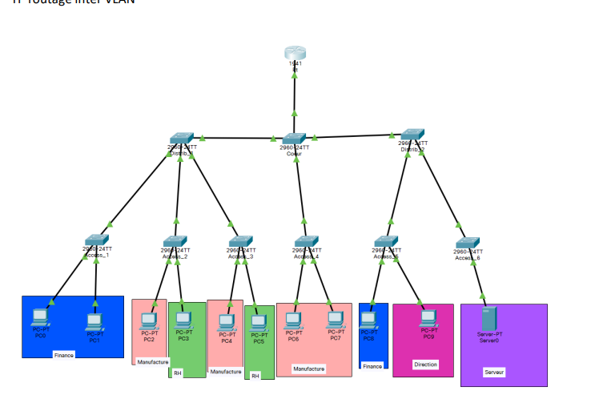
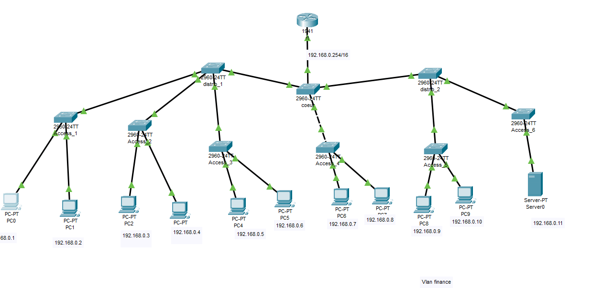
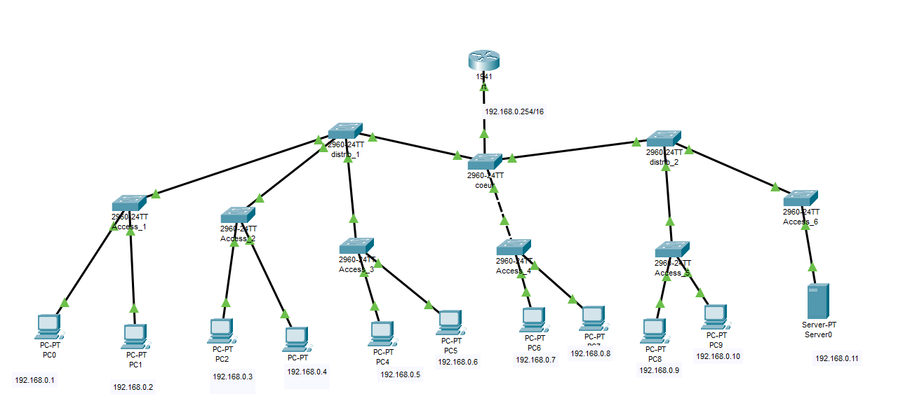
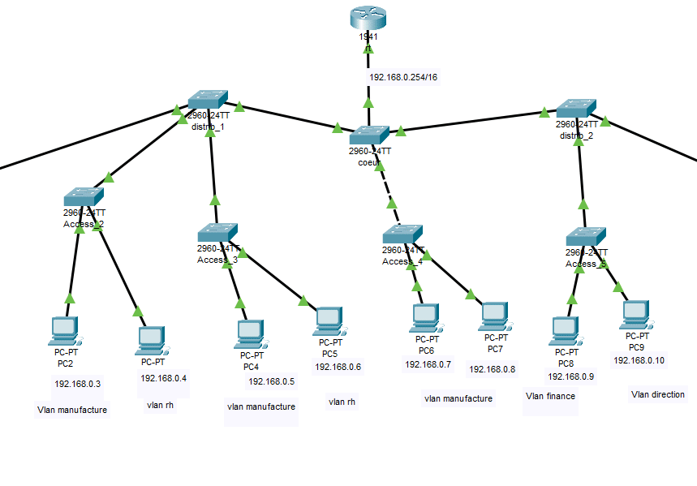

# Explication Packet Tracer

**Ceci est une explication du tp 1 Packet tracer d'après moi.**

**Je ne pense pas avoir tout le tp correcte mais j'essaie d'expliquer au max.**


Pour plus d'explications ou si vous avez besoin d'aide voici mon discord : 
- *Ethan.💤#1337*


  
# Sommaire
- [Comprendre le réseaux](#comprendre-le-réseaux)
- [Commencer le tp](#commencer-le-tp)
	- [Configurer les IP](#configurer-les-ip)
	-  [Configurer les VLAN](#configurer-les-vlan) 
- [Test du réseau](#test-du-réseau)
- [Le mode trunk](#le-mode-trunk)
- [Autre](#autre)
- [Rappel et mémo](#rappel-et-mémo)

# Comprendre le réseaux

Voici le réseaux à refaire.



Le réseaux montré est constitué de 10 machines et un serveur. Il faudra les configuré comme demandé dans ce réseaux **192.168.0.0/16"**

En dessus des switch relié au différentes machines et entre eux le tout jusqu'à un routeur.

Les fond de couleurs signifie dans quel VLAN ils serrons.

  

*C'est quoi un VLAN ?*

*"Un VLAN, pour Virtual Local Area Network, décrit un type de réseau local. On le traduit en français par réseau local virtuel.*

*Le VLAN regroupe, de façon logique et indépendante, un ensemble de machines informatiques. On peut en retrouver plusieurs coexistant simultanément sur un même commutateur réseau." - Journaldunet.fr*

  

*En gros un VLAN c'est un réseau virtuel qui permet de regrouper plusieurs machine dans un réseaux fermé et définit pour choisir en gros qui communique avec qui*

  

Comme indiqué sur tp il y aura plusieurs VLAN pour chaque services :

+ Un VLAN pour le service de finance

+ Un VLAN pour le service de manufacture

+ Un VLAN pour le service de la RH

+ Un VLAN pour la direction

+ Et un VLAN pour le serveur

Il faudra nommé les VLAN et les assignés au bonne machine.

Il faudra aussi nommé les machines.

  

# Commencer le tp

  

### Configurer les IP

Pour commencer le tp il faut refaire le réseau donné sur packet tracer.

  

⚠️ **Faite attention à l'[interfaces](#rappel-et-mémo) ou vous branchez vos câbles ! Il faudra s'en souvenir dans le config !**

  

Il faudra comme expliqué plus haut définir les IP.

Pour configurer l'IP d'une machine voici la marche à suivre.

  



  
  

⚠️ **Il faut aussi configurer une IP sur le router !**

Pour plus de simplicité j'ai mis les IP sous les machines.

  



  

### Configurer les VLAN

Nous allons maintenant passer à la configuration des vlan avec les commandes **cisco CLI**.

Je ne vais pas expliquer toute les commandes possibles !

Je vous renvoie sur le [memo](https://gitlab.com/it4lik/b2-reseau-2021/-/blob/main/cours/memo/memo_cisco.md) fait par Léo sur les commandes cisco.

  

**Passons maintenant au commandes.**

Après avoir cliqué sur un switch et être allé dans l'onglet "CLI" vous arrivez sur une console.

```

Switch>

```

La première commande importante est "Enable" qui permet de passer en mode "administrateur" qui vous permet de faire des modifications sur la machine.

  

```

Switch>enable

```

Apres avoir lancé la commande enable un "#" serra affiché a coté du nom de la machine. Ce qui signifie que vous êtes en mode administrateur.

  

Pour commencer il faut définir les VLAN et les nommés.

J'ai décidé de définir mes VLAN comme ceci

+ Vlan 10 Finance

+ Vlan 20 Manufacture

+ VLAN 30 RH

+ VLAN 40 Direction

+ VLAN 50 Serveur

Pour cela il faut rentrer dans le menu de configuration de la machine.

Pour ceci il faudra utilisé la commande **conf t**

```markdown

Switch>#

Enter configuration commands, one per line. End with CNTL/Z.

## Le (config) signifie que vous êtes en mode configuration

Switch(config)#

```

Il faut avant tout définir le nom de sa machine.

J'ai choisi de commencer par le switch "Access-1"

Pour le nommer il faut la commande **hostname**

```markdown

Switch(config)#hostname Access_1

## Comme on peut le voir le nom de la machine est bien changé.

Access_1(config)#

```

Il faut ensuite créer un VLAN et le nommé.

Pour cela rien de plus simple la commande **vlan [NUMERO DE LA VLAN]** existe.

```markdown

##J'ai choisi de commencer par le VLAN 10

Access_1(config)# vlan 10

##Je peasse en mode configuration du VLAN

Access_1(config-vlan)#

```

Pour le nommer et pour mieux le repérer par la suite je vais l'appeler "VFinance" avec le commande **name**

  

```

Access_1(config-vlan)# name VFinance

  

Access_1(config-vlan)#

```

  

Pour vérifié les VLAN existant sur la machine vous pouvez utilisé la commande **show VLAN**

  

⚠️ **Cette commande de marche pas en mode config. Il faut donc sortir du mode config en faisant "exit" jusqu'à retrouvé seulement le nom de la machine et le #**

```markdown

Access_1(config-vlan)#exit

  

Access_1(config)#exit

  

Access_1#

## Je quite le mode config

%SYS-5-CONFIG_I: Configured from console by console

  

  

Access_1#show vlan

VLAN Name Status Ports

  

---- -------------------------------- --------- -------------------------------

  

1 default active Fa0/1, Fa0/2, Fa0/3, Fa0/4

  

Fa0/5, Fa0/6, Fa0/7, Fa0/8

  

Fa0/9, Fa0/10, Fa0/11, Fa0/12

  

Fa0/13, Fa0/14, Fa0/15, Fa0/16

  

Fa0/17, Fa0/18, Fa0/19, Fa0/20

  

Fa0/21, Fa0/22, Fa0/23, Fa0/24

  

Gig0/1, Gig0/2

##Comme nous pouvons le voir mon vlan est bien ici et nommé.

10 VFinance active

  

1002 fddi-default active

  

1003 token-ring-default active

  

1004 fddinet-default active

  

1005 trnet-default active

```

Pour définir un VLAN sur une interfaces c'est tout aussi simple.

Il faudra retourner dans le mode config avec la commande **conf t**

Et ensuite configurer l'interfaces.

  

*C'est quoi une interfaces ?*

*Ici une interfaces c'est l'endroit ou vous avez branché votre câbles. L'interfaces en gros c'est une prise ethernet.*

  

Pour configurer une interfaces c'est la même chose avec les vlan il faut dire le nom de l'interfaces qu'on veut configurer. Ici "fastEthernet 0/1"

  

```markdown

## Je repasse en mode config

Access_1#conf t

## Je choisi de configurer l'interfaces fastEthernet 0/1

Access_1(config)#interface fastEthernet 0/1

##config-if signifie qu'on configure une interfaces

Access_1(config-if)#

```

Il faut ensuite définir le VLAN sur l'interfaces. Pour cela il faut utiliser la commande **switchport**

```markdown

## Avec cette commande je change le "port" en acces sur le VLAN 10

## Le mode access signifie qu'il véhicule du trafic dit "Untagged"

##(Flemme de rentrer dans les detailles la)

Access_1(config-if)#switchport access vlan 10

```

Si nous retournons voir le show vlan nous verrons que maintenant l'interfaces fastEthernet 0/1 est sur le VLAN 10.

```markdown

## Je sors du mode config de l'interfaces, pour configurer une nouvelle interface nous devons êtres dans le config et pas dans le config-if

Access_1(config-if)#exit

## Je sors du mode config

Access_1(config)#exit

  

Access_1#

  

%SYS-5-CONFIG_I: Configured from console by console

  

  

Access_1#show vlan

  

  

VLAN Name Status Ports

  

---- -------------------------------- --------- -------------------------------

  

1 default active Fa0/2, Fa0/3, Fa0/4, Fa0/5

  

Fa0/6, Fa0/7, Fa0/8, Fa0/9

  

Fa0/10, Fa0/11, Fa0/12, Fa0/13

  

Fa0/14, Fa0/15, Fa0/16, Fa0/17

  

Fa0/18, Fa0/19, Fa0/20, Fa0/21

  

Fa0/22, Fa0/23, Fa0/24, Gig0/1

  

Gig0/2

## l'interfaces FA 0/1 (fastEthernet 0/1) est maintenant sur le VLAN 10

10 VFinance active Fa0/1

  

1002 fddi-default active

  

1003 token-ring-default active

  

1004 fddinet-default active

  

1005 trnet-default active

```
Plus qu'a faire ça sur tout les switch !

**Pour les switch distrib_1 , distrib_2 & cœur il faudra aussi ajouter les VLAN qui transiteront sur le switch !
Par exemple sur le switch "distrib_1" il faut ajouter les VLAN manufacture, RH et finance car ce sont les seuls qui passeront pas ce switch.**

### Test du réseau
Afin de vérifié au bon fonctionnement du réseau après la configuration des VLAN nous allons ping des machines entres elles.
Pour cela nous allons ouvrir le cmd d'un pc !
Voici comment ouvrir un CMD sur une des machines 

Le premier ping serra uniquement au niveau du switch Access_1 le ping serra donc dans le même vlan.

```markdown
## Je ping depuis 192.168.0.1 vers 192.168.0.2
C:\>ping 192.168.0.2

Pinging 192.168.0.2 with 32 bytes of data:
## Le ping fonctionne
Reply from 192.168.0.2: bytes=32 time<1ms TTL=128
```
Nous allons maintenant tester le ping entre deux machines qui sont sur le même switch mais pas le même vlan par exemple manufacture ping RH
```markdown
## Je ping depuis 192.168.0.3 vers 192.168.0.4 qui sont sur le même switch.
C:\>ping 192.168.0.4

Pinging 192.168.0.4 with 32 bytes of data:
## Le ping ne marche pas
Request timed out.
```
Voici l'utilité d'un VLAN. Un VLAN permet d'isoler les machines dans des groupes afin qu'ils ne puissent communiquer qu'entre eux. Cela rend le réseau plus sécurisé.

Cependant si j'essaie de ping une IP qui est dans le même VLAN mais pas le même switch cela ne marche pas.
```markdown
## Je ping de 192.168.0.3 qui est dans le même vlan
C:\>ping 192.168.0.5

Pinging 192.168.0.5 with 32 bytes of data:
Ping statistics for 192.168.0.5:
Packets: Sent = 1, Received = 0, Lost = 1 (100% loss),
```
La raison est simple... Les switch doivent être connecté entre eux avec le mod trunks !

## Le mode trunk

*C'est quoi le mod trunk ?*
*Le mode trunk (aussi nommer 802.1Q) est un protocole qui permet de faire transiter des vlan au seins d'un même réseau*
*En gros tu connecte tes switch en trunk et ils marchent entre eux :)*


Pour faire ça comme tout à l'heure !
```markdown
Access_1>enable

Access_1#conf t

Access_1(config)#interface FastEthernet0/24
## La différence de tout à l'heure je change le access en trunk
Access_1(config-if)#switchport mode trunk
```

Et si je refais le ping maintenant 
```markdown
## Je ping de 192.168.0.3 qui est dans le même vlan
C:\>ping 192.168.0.5

Pinging 192.168.0.5 with 32 bytes of data:

## Le ping fonctionne 
Reply from 192.168.0.5: bytes=32 time<1ms TTL=128

Reply from 192.168.0.5: bytes=32 time<1ms TTL=128

Reply from 192.168.0.5: bytes=32 time=6ms TTL=128

Reply from 192.168.0.5: bytes=32 time=1ms TTL=128
```

  
# Autre
Voici les commandes qui sont d'après moi utile pour finir le TP.

Mais j'espère que ma petite explications vous aura servie à mieux comprendre certaines choses.

**Voici aussi mon fichier packet tracer [`tp-1.pkt`](https://github.com/ImShEthan/Tutor-reseau/blob/main/Tp-1/file/tp_1.pkt)** ;)


S'il manque des informations merci de me le faire remonter rapidement :)

❤️**Bisous les ploucs !** ❤️

# Rappel et mémo
### *C'est quoi un Vlan ?*

*"Un VLAN, pour Virtual Local Area Network, décrit un type de réseau local. On le traduit en français par réseau local virtuel.*

*Le VLAN regroupe, de façon logique et indépendante, un ensemble de machines informatiques. On peut en retrouver plusieurs coexistant simultanément sur un même commutateur réseau." - Journaldunet.fr*

  

*En gros un VLAN c'est un réseau virtuel qui permet de regrouper plusieurs machine dans un réseaux fermé et définit pour choisir en gros qui communique avec qui*

### *C'est quoi une interfaces ?*

*Ici une interfaces c'est l'endroit ou vous avez branché votre câbles. L'interfaces en gros c'est une prise ethernet.*

### *C'est quoi le mod trunk ?*
*Le mode trunk (aussi nommer 802.1Q) est un protocole qui permet de faire transiter des vlan au seins d'un même réseau*
*En gros tu connecte tes switch en trunk et ils marchent entre eux :)*

### *Pourquoi utiliser des VLAN ?*

*Les VLAN permettent d'isoler des machines dans des "groupes" privé ou uniquement eux peuvent discuté.*

*Le but est de sécuriser un max le réseaux. Si une nouvelle personne se connecte sur le réseaux comme il n'appartiendra a aucun VLAN il ne pourra communiquer avec aucune machine du réseau.*

